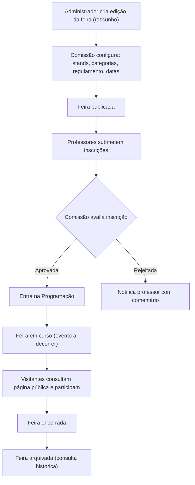
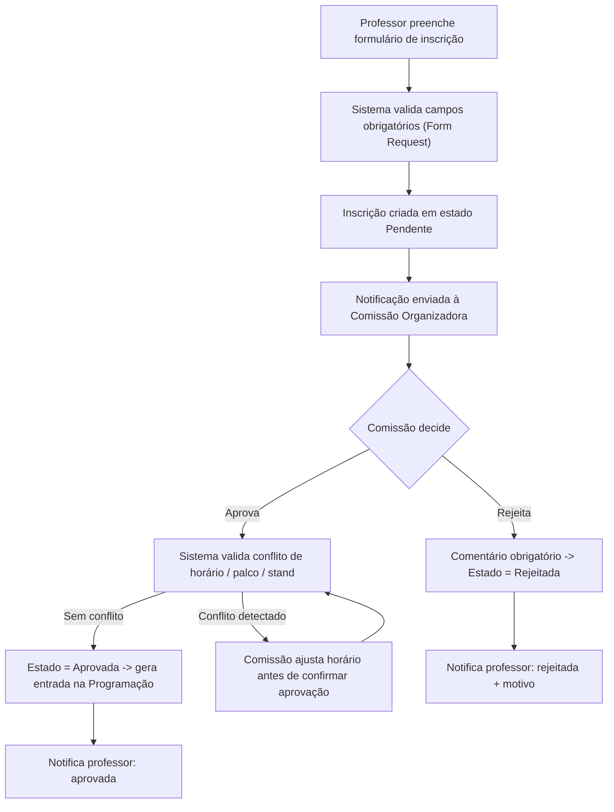
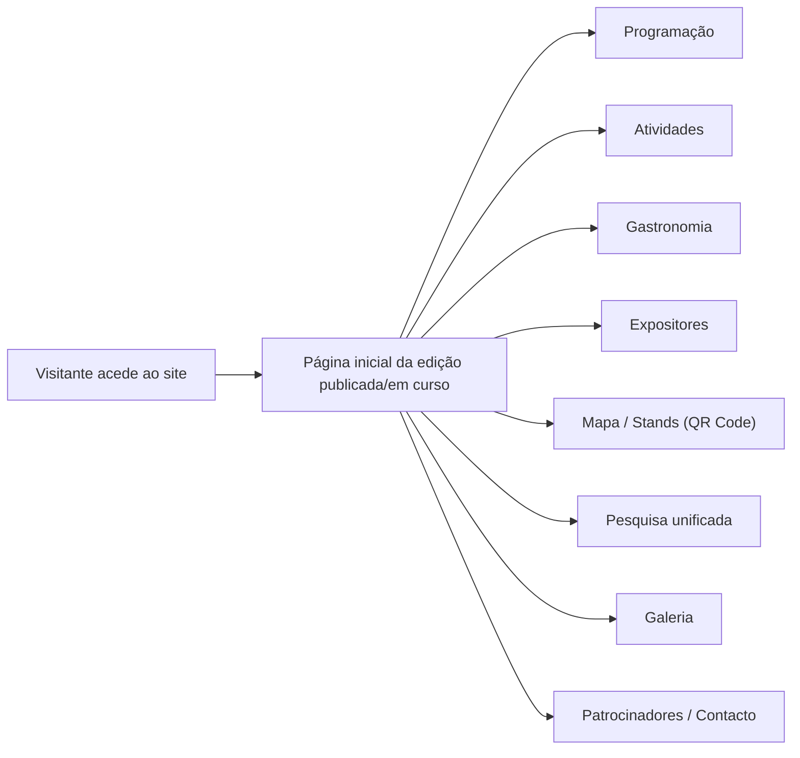
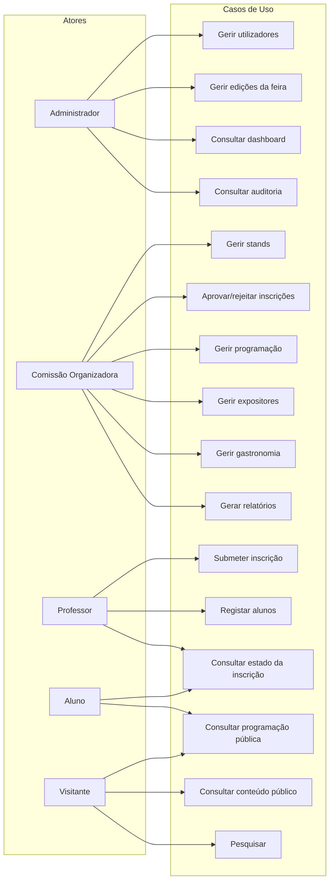
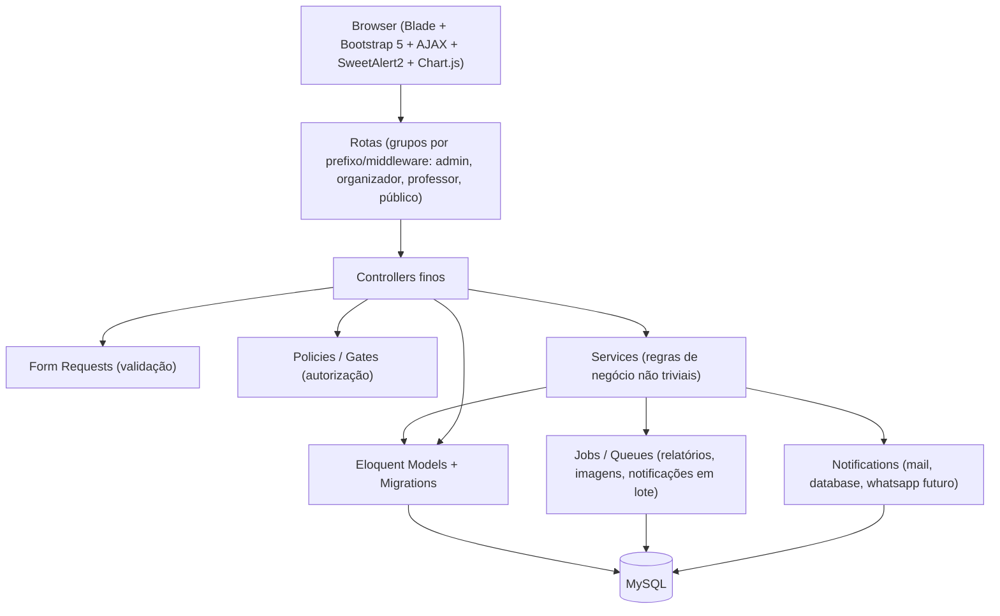
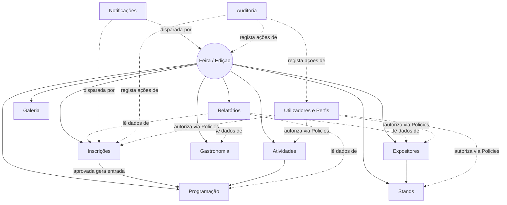

# Etapa 2 — Modelagem do Sistema

Sistema de Gestão de Feira Gastronómica e Cultural Escolar (Laravel)

Esta etapa traduz os requisitos da [Etapa 1](01-levantamento-requisitos.md) em fluxos, casos de uso, módulos e arquitetura — ainda sem nenhuma decisão de banco de dados (isso é a Etapa 3).

---

## 1. Fluxogramas

### 1.1 Ciclo de vida de uma edição da feira

Regra associada: apenas uma edição pode estar `publicada` ou `em curso` ao mesmo tempo (RN02).

### 1.2 Inscrição e aprovação (fluxo detalhado)

Regras associadas: RN05, RN06, RN07, RF16, RF21.

### 1.3 Navegação pública (Visitante, sem login)

---

## 2. Casos de Uso

### 2.1 Por ator

**Administrador**
- UC01 — Gerir utilizadores e atribuir perfis
- UC02 — Gerir edições da feira (criar, editar, publicar, arquivar)
- UC03 — Consultar dashboard global e relatórios
- UC04 — Consultar logs de auditoria
- UC05 — Gerir configurações gerais do sistema

**Comissão Organizadora**
- UC06 — Gerir stands
- UC07 — Aprovar ou rejeitar inscrições
- UC08 — Gerir programação (geração automática e reorganização manual)
- UC09 — Gerir expositores
- UC10 — Gerir gastronomia
- UC11 — Gerir galeria (fotos/vídeos)
- UC12 — Gerar relatórios (PDF/Excel)
- UC13 — Transicionar o estado da edição corrente no ciclo normal (publicada → em curso → encerrada) — *ver esclarecimento sobre autoridade de publicação em [docs/04-perfis-utilizadores.md](04-perfis-utilizadores.md), secção 2*

**Professor**
- UC14 — Submeter inscrição (atividade ou expositor) em nome de turma/aluno
- UC15 — Registar alunos da própria turma
- UC16 — Consultar estado das próprias inscrições
- UC17 — Atualizar dados de uma inscrição enquanto pendente

**Aluno** (conta opcional, uso apenas de consulta)
- UC18 — Consultar programação pública
- UC19 — Consultar estado da própria participação

**Visitante** (sem conta)
- UC20 — Consultar atividades, gastronomia, expositores, mapa e galeria
- UC21 — Pesquisar conteúdo público
- UC22 — Consultar patrocinadores e página de contacto

### 2.2 Diagrama de casos de uso (aproximação em Mermaid)

---

## 3. Diagrama de Funcionalidades (mapa de módulos)

```mermaid
flowchart TD
    Sistema["Sistema de Gestão da Feira"]

    Sistema --> M1["Gestão da Feira (edições)"]
    Sistema --> M2["Utilizadores e Perfis"]
    Sistema --> M3["Expositores"]
    Sistema --> M4["Stands"]
    Sistema --> M5["Atividades"]
    Sistema --> M6["Gastronomia"]
    Sistema --> M7["Inscrições"]
    Sistema --> M8["Programação"]
    Sistema --> M9["Dashboard"]
    Sistema --> M10["Página Pública"]
    Sistema --> M11["Galeria"]
    Sistema --> M12["Pesquisa"]
    Sistema --> M13["Relatórios"]
    Sistema --> M14["Notificações"]
    Sistema --> M15["Auditoria"]

    M1 --> M1a["CRUD edição, estado, banner, regulamento"]
    M3 --> M3a["CRUD, categoria, fotos, stand associado"]
    M4 --> M4a["CRUD, QR Code, capacidade"]
    M5 --> M5a["CRUD, tipo, palco, conflito de horário"]
    M6 --> M6a["CRUD, categoria, preço, disponibilidade"]
    M7 --> M7a["Formulário, aprovação, estado"]
    M8 --> M8a["Geração automática + reorganização manual"]
    M9 --> M9a["Contadores + gráficos (Chart.js)"]
    M13 --> M13a["PDF / Excel via Jobs"]
    M14 --> M14a["Email + interno (WhatsApp futuro)"]
```

---

## 4. Módulos do Sistema

| Módulo | Responsabilidade principal | Atores envolvidos |
|---|---|---|
| Gestão da Feira | Ciclo de vida da edição (rascunho → arquivada), dados institucionais | Administrador |
| Utilizadores e Perfis | Contas, papéis, permissões | Administrador |
| Expositores | Cadastro e associação a stand/professor/turma | Comissão, Professor |
| Stands | Alocação física, QR Code, capacidade | Comissão |
| Atividades | Programação cultural (teatro, dança, etc.) | Comissão, Professor |
| Gastronomia | Cardápio informativo | Comissão, Professor |
| Inscrições | Formulário e fluxo de aprovação | Professor, Comissão |
| Programação | Agenda consolidada da feira | Comissão |
| Dashboard | Indicadores e gráficos em tempo real | Administrador, Comissão |
| Página Pública | Vitrine da feira sem necessidade de login | Visitante |
| Galeria | Fotos e vídeos por categoria | Comissão |
| Pesquisa | Busca unificada sobre conteúdo público | Visitante |
| Relatórios | Exportações PDF/Excel | Administrador, Comissão |
| Notificações | Email e avisos internos, canal WhatsApp preparado | Sistema (transversal) |
| Auditoria | Registo de ações sensíveis | Administrador |

Cada módulo corresponde, em código, a um conjunto coeso de Model(s) + Controller(s) + Policy + Form Requests + Views — sem necessidade de módulos de package isolados (overkill para este escopo), mas com fronteiras claras de responsabilidade dentro da estrutura padrão do Laravel.

---

## 5. Estrutura do Sistema (arquitetura)

Aplicando "Clean Architecture quando fizer sentido" (regra do projeto): não se justifica uma arquitetura hexagonal completa com interfaces para cada módulo — seria sobre-engenharia para este porte de projeto. Em vez disso, aplica-se separação de responsabilidades disciplinada, dentro dos padrões idiomáticos do Laravel:

**Critério para usar Service em vez de lógica direta no Controller/Model:**
- Usar **Service** quando a regra atravessa mais de uma entidade ou tem passos condicionais (ex.: `InscricaoAprovacaoService` — valida conflito de horário/palco/stand e só então muda o estado e gera a entrada na Programação; `ProgramacaoGeradorService` — monta a agenda automática a partir das inscrições aprovadas).
- Manter **CRUD simples direto no Controller** (com Form Request + Policy) quando não há lógica de negócio além de gravar dados — por exemplo, CRUD de Stands ou de itens de Gastronomia. Criar uma camada de Service aqui só adicionaria indireção sem benefício.
- **Policies** por Model para autorização baseada em papel e em contexto (ex.: um Professor só pode editar a própria inscrição enquanto ela estiver `pendente`).
- **Gates** para regras transversais que não pertencem a um único Model (ex.: "só é possível editar conteúdo operacional se a edição da feira não estiver `arquivada`").
- **Jobs/Queues** para tudo que for pesado ou não precisa de resposta imediata: geração de relatórios, redimensionamento de imagens da galeria, envio de notificações em lote.

Organização de pastas (nível conceptual, sem código ainda):
- `app/Models` — um Model por entidade, todos (exceto Utilizador e tabelas puramente de configuração) com `feira_id` e `SoftDeletes` onde aplicável.
- `app/Http/Controllers/Admin`, `.../Organizador`, `.../Professor`, `.../Public` — separação por área de acesso, refletindo os grupos de rotas.
- `app/Http/Requests` — um Form Request por operação de escrita relevante.
- `app/Policies` — uma Policy por Model que precisa de autorização granular.
- `app/Services` — apenas para as regras de negócio não triviais identificadas acima.
- `app/Notifications` — uma Notification por evento (nova inscrição, mudança de estado, publicação da programação).
- `app/Jobs` — geração de relatórios e processamento de imagens.
- `resources/views/admin`, `.../public` — Blade separado por área, com layout próprio (paleta amarelo/laranja/branco/cinza claro/verde definida na Etapa 6).

---

## 6. Relações entre Módulos

**Leitura do diagrama:**
- `Feira` é o módulo central — todos os módulos operacionais dependem dele via `feira_id` (RN01), garantindo isolamento entre edições (multi-edição confirmada na Etapa 1).
- `Inscrições → Programação` é a única via de entrada na agenda (RN07).
- `Expositores → Stands` é uma associação opcional 1‑para‑1 por edição (RN03).
- `Relatórios`, `Notificações` e `Auditoria` são módulos transversais: não possuem regras de negócio próprias sobre "o que fazer", apenas leem ou reagem a eventos dos módulos operacionais.
- `Utilizadores e Perfis` não aparece como "dono" de dados operacionais, mas autoriza (via Policies/Gates) o acesso a todos eles — é a espinha dorsal de segurança do sistema (RNF02).

---

## 7. Estado desta etapa

Modelagem do sistema concluída: fluxogramas do ciclo de vida da feira, do fluxo de inscrição/aprovação e da navegação pública; casos de uso por ator; mapa de funcionalidades; tabela de módulos; arquitetura em camadas com critério explícito para uso de Services; e diagrama de relações entre módulos.

Pendente: revisão e aprovação do utilizador antes de avançar para a **Etapa 3 — Modelagem da Base de Dados** (MER, tabelas, campos, tipos, índices, chaves estrangeiras).
