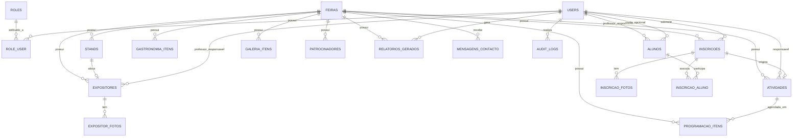

# Etapa 3 — Modelagem da Base de Dados

Sistema de Gestão de Feira Gastronómica e Cultural Escolar (Laravel + MySQL)

Baseado nos requisitos ([Etapa 1](01-levantamento-requisitos.md)) e na arquitetura de módulos ([Etapa 2](02-modelagem-do-sistema.md)). Ainda sem código — este documento é o desenho da base de dados; as migrations Laravel são geradas a partir dele (ver secção 7).

---

## 1. Decisões técnicas desta etapa

Estas decisões não estavam explícitas nos requisitos e têm impacto direto na estrutura das tabelas, por isso ficam registadas com a respetiva justificação.

**1.1 — Papéis (roles) em tabela própria + pivot, em vez de coluna fixa em `users`**
Em vez de um `enum role` direto na tabela `users`, criam-se `roles` + `role_user` (N‑para‑N). Justificação: no contexto escolar é plausível que a mesma pessoa acumule papéis (ex.: um professor que também integra a Comissão Organizadora). Um enum fixo obrigaria a duplicar conta ou a "forçar" um papel só; a tabela pivot resolve isto sem custo relevante (são só 2 tabelas extra) e mantém a checagem de permissões simples via Policies/Gates a olhar para os *slugs* dos papéis.

**1.2 — `Atividade` separada de `ItemDeProgramação`**
`atividades` guarda o **conteúdo** (título, tipo, descrição, responsável, foto) — pode nascer diretamente (criada pela Comissão) ou a partir de uma inscrição aprovada (`inscricoes.id` referenciado). `programacao_itens` guarda o **agendamento** (data, hora início/fim, local, palco) de uma atividade. Justificação: a Etapa 2 já define que "reorganizar a agenda" (RF25) deve ser possível sem alterar o conteúdo da atividade — separar as duas evita que mover um horário exija reescrever a descrição/foto/responsável, e permite (no futuro) uma atividade ter mais de uma sessão.

**1.3 — Sem tabelas `professores` e `turmas` dedicadas**
"Professor" e "Aluno" são utilizadores (`users`) com o papel correspondente; "turma" é guardada como um campo de texto simples (`varchar`) nas tabelas onde é mencionada nos requisitos (`expositores`, `inscricoes`, `alunos`), em vez de uma entidade `turmas` própria. Justificação: nenhum requisito da Etapa 1 pede um CRUD de turmas (criar/editar/listar turmas como entidade) — modelar isso agora seria complexidade sem requisito que a justifique. Se essa necessidade aparecer depois, o campo evolui para uma FK sem quebrar dados existentes.

**1.4 — `alunos` como tabela própria, distinta de `users`**
Um Aluno só tem conta de login (`user_id` opcional) se isso for decidido caso a caso; a entidade `alunos` existe mesmo sem conta, porque o Professor precisa de registar alunos da turma (RF04) e associá-los a inscrições (participantes nomeados), independentemente de o aluno alguma vez aceder ao sistema.

**1.5 — Garantir a nível de base de dados que só existe uma feira "ativa"**
RN02 diz que só uma edição pode estar `publicada` ou `em_curso` ao mesmo tempo. Em vez de confiar só na validação da aplicação, usa-se uma coluna gerada `estado_ativo` que só tem valor (uma constante fixa) quando `estado` está em `publicada`/`em_curso`, e é `NULL` nos restantes estados — com um índice `UNIQUE` sobre essa coluna. Como o MySQL não conta múltiplos `NULL` como duplicados num índice único, isto impede *ao nível do motor de base de dados* que duas edições fiquem ativas ao mesmo tempo, mesmo que exista uma falha de validação na aplicação.

**1.6 — QR Code do stand: token, não imagem**
`stands.qr_token` guarda uma string única (UUID curto); a imagem do QR Code é gerada em tempo real por uma rota pública (`/stand/{qr_token}`) usando uma biblioteca (ex. `simplesoftwareio/simple-qrcode`), em vez de guardar um ficheiro de imagem por stand. Justificação: evita reprocessar/guardar imagens sempre que o stand muda, e o token serve diretamente de chave de acesso público seguro (não sequencial, ao contrário do `id`).

**1.7 — Isolamento multi-edição (RN01)**
Todas as tabelas operacionais (`stands`, `expositores`, `atividades`, `gastronomia_itens`, `inscricoes`, `programacao_itens`, `galeria_itens`, `patrocinadores`, `relatorios_gerados`) têm `feira_id NOT NULL` com FK para `feiras`. Nenhuma consulta a estas tabelas deve ocorrer sem filtrar por `feira_id` — isto será garantido na Etapa 8 através de um *global scope* Eloquent, evitando repetir `->where('feira_id', ...)` em cada query (reutilização, sem duplicação).

---

## 2. Modelo Entidade-Relacionamento (MER)

---

## 3. Dicionário de Dados

### 3.1 `roles`
| Campo | Tipo | Null | Restrições |
|---|---|---|---|
| id | bigint unsigned, PK | não | auto_increment |
| slug | varchar(30) | não | unique (ex.: `administrador`, `comissao`, `professor`, `aluno`) |
| nome | varchar(60) | não | — |
| timestamps | — | — | created_at, updated_at |

### 3.2 `users`
| Campo | Tipo | Null | Restrições |
|---|---|---|---|
| id | bigint unsigned, PK | não | |
| name | varchar(150) | não | |
| email | varchar(190) | não | unique |
| email_verified_at | timestamp | sim | |
| password | varchar(255) | não | hash |
| telefone | varchar(30) | sim | |
| avatar_path | varchar(255) | sim | |
| ativo | boolean | não | default true |
| remember_token | varchar(100) | sim | |
| timestamps + deleted_at | — | — | soft delete |

### 3.3 `role_user`
| Campo | Tipo | Null | Restrições |
|---|---|---|---|
| user_id | bigint unsigned, FK → users.id | não | on delete cascade |
| role_id | bigint unsigned, FK → roles.id | não | on delete cascade |
| — | — | — | PK composta (user_id, role_id) |

### 3.4 `alunos`
| Campo | Tipo | Null | Restrições |
|---|---|---|---|
| id | bigint unsigned, PK | não | |
| nome | varchar(150) | não | |
| turma | varchar(50) | não | |
| professor_id | bigint unsigned, FK → users.id | não | professor responsável |
| user_id | bigint unsigned, FK → users.id | sim | conta de login opcional |
| timestamps + deleted_at | — | — | soft delete |

### 3.5 `feiras`
| Campo | Tipo | Null | Restrições |
|---|---|---|---|
| id | bigint unsigned, PK | não | |
| tema | varchar(150) | não | |
| descricao | text | sim | |
| data_inicio | date | não | |
| data_fim | date | não | |
| hora_abertura | time | não | |
| hora_encerramento | time | não | |
| local | varchar(200) | não | |
| banner_path | varchar(255) | sim | |
| logotipo_path | varchar(255) | sim | |
| regulamento_path | varchar(255) | sim | PDF do regulamento |
| estado | enum(rascunho, publicada, em_curso, encerrada, arquivada) | não | default `rascunho` |
| estado_ativo | varchar(10), **gerada pela aplicação** | sim | valor fixo (`ATIVA`) apenas quando `estado` ∈ {publicada, em_curso}; `NULL` nos restantes — **unique** (ver decisão 1.5) |
| timestamps + deleted_at | — | — | soft delete |

### 3.6 `stands`
| Campo | Tipo | Null | Restrições |
|---|---|---|---|
| id | bigint unsigned, PK | não | |
| feira_id | bigint unsigned, FK → feiras.id | não | |
| numero | varchar(20) | não | unique junto com `feira_id` |
| localizacao | varchar(150) | sim | |
| capacidade | smallint unsigned | sim | |
| responsavel_id | bigint unsigned, FK → users.id | sim | |
| categoria | varchar(80) | sim | |
| estado | enum(disponivel, reservado, ocupado, inativo) | não | default `disponivel` |
| qr_token | char(12) | não | unique |
| timestamps + deleted_at | — | — | soft delete |

### 3.7 `expositores`
| Campo | Tipo | Null | Restrições |
|---|---|---|---|
| id | bigint unsigned, PK | não | |
| feira_id | bigint unsigned, FK → feiras.id | não | |
| professor_id | bigint unsigned, FK → users.id | não | |
| turma | varchar(50) | não | |
| categoria | varchar(80) | sim | |
| descricao | text | sim | |
| stand_id | bigint unsigned, FK → stands.id | sim | **unique** (1 stand → no máx. 1 expositor) |
| estado | enum(pendente, ativo, inativo) | não | default `pendente` |
| timestamps + deleted_at | — | — | soft delete |

### 3.8 `expositor_fotos`
| Campo | Tipo | Null | Restrições |
|---|---|---|---|
| id | bigint unsigned, PK | não | |
| expositor_id | bigint unsigned, FK → expositores.id | não | on delete cascade |
| path | varchar(255) | não | |
| ordem | smallint unsigned | não | default 0 |
| timestamps | — | — | |

### 3.9 `atividades`
| Campo | Tipo | Null | Restrições |
|---|---|---|---|
| id | bigint unsigned, PK | não | |
| feira_id | bigint unsigned, FK → feiras.id | não | |
| inscricao_id | bigint unsigned, FK → inscricoes.id | sim | unique; preenchido quando a atividade nasce de uma inscrição aprovada |
| tipo | enum(teatro, danca, musica, poesia, ciencias, artesanato, pintura, jogos, outro) | não | |
| titulo | varchar(150) | não | |
| descricao | text | sim | |
| responsavel_id | bigint unsigned, FK → users.id | sim | |
| participantes_previstos | smallint unsigned | sim | |
| foto_path | varchar(255) | sim | |
| estado | enum(planeada, confirmada, cancelada) | não | default `planeada` |
| timestamps + deleted_at | — | — | soft delete |

### 3.10 `programacao_itens`
| Campo | Tipo | Null | Restrições |
|---|---|---|---|
| id | bigint unsigned, PK | não | |
| feira_id | bigint unsigned, FK → feiras.id | não | redundante com `atividades.feira_id`, mantido para consultas diretas de agenda por edição |
| atividade_id | bigint unsigned, FK → atividades.id | não | on delete cascade |
| data | date | não | |
| hora_inicio | time | não | |
| hora_fim | time | não | |
| local | varchar(150) | não | |
| palco | varchar(80) | sim | |
| timestamps | — | — | |

Índice `(feira_id, data, palco)` para acelerar a verificação de sobreposição (RN04) — a validação de conflito em si é lógica de aplicação (Service), não uma constraint SQL, porque comparar intervalos de hora sobrepostos não é expressável de forma direta como `UNIQUE`/`CHECK`.

### 3.11 `gastronomia_itens`
| Campo | Tipo | Null | Restrições |
|---|---|---|---|
| id | bigint unsigned, PK | não | |
| feira_id | bigint unsigned, FK → feiras.id | não | |
| nome | varchar(120) | não | |
| categoria | varchar(80) | sim | |
| descricao | text | sim | |
| preco | decimal(8,2) | não | `CHECK (preco >= 0)` |
| foto_path | varchar(255) | sim | |
| ingredientes | text | sim | |
| disponivel | boolean | não | default true |
| quantidade_disponivel | int unsigned | sim | `NULL` = sem limite |
| timestamps + deleted_at | — | — | soft delete |

### 3.12 `inscricoes`
| Campo | Tipo | Null | Restrições |
|---|---|---|---|
| id | bigint unsigned, PK | não | |
| feira_id | bigint unsigned, FK → feiras.id | não | |
| professor_id | bigint unsigned, FK → users.id | não | autor da inscrição |
| tipo_participante | enum(professor, aluno) | não | em nome de quem é a inscrição |
| turma | varchar(50) | sim | |
| telefone | varchar(30) | não | |
| email | varchar(190) | não | |
| tipo_atividade | enum(teatro, danca, musica, poesia, ciencias, artesanato, pintura, jogos, outro) | não | |
| descricao | text | sim | |
| numero_participantes | smallint unsigned | não | `CHECK (numero_participantes >= 1)` |
| necessita_palco | boolean | não | default false |
| necessita_eletricidade | boolean | não | default false |
| necessita_projetor | boolean | não | default false |
| necessita_som | boolean | não | default false |
| numero_mesas | smallint unsigned | não | default 0 |
| numero_cadeiras | smallint unsigned | não | default 0 |
| horario_pretendido | time | sim | |
| duracao_minutos | smallint unsigned | sim | |
| observacoes | text | sim | |
| estado | enum(pendente, aprovada, rejeitada) | não | default `pendente` |
| comentario_avaliacao | text | sim | obrigatório na aplicação quando `estado = rejeitada` |
| avaliado_por | bigint unsigned, FK → users.id | sim | membro da Comissão |
| avaliado_em | timestamp | sim | |
| timestamps + deleted_at | — | — | soft delete |

### 3.13 `inscricao_fotos`
| Campo | Tipo | Null | Restrições |
|---|---|---|---|
| id | bigint unsigned, PK | não | |
| inscricao_id | bigint unsigned, FK → inscricoes.id | não | on delete cascade |
| path | varchar(255) | não | |
| timestamps | — | — | |

### 3.14 `inscricao_aluno`
| Campo | Tipo | Null | Restrições |
|---|---|---|---|
| inscricao_id | bigint unsigned, FK → inscricoes.id | não | on delete cascade |
| aluno_id | bigint unsigned, FK → alunos.id | não | on delete cascade |
| — | — | — | PK composta (inscricao_id, aluno_id) |

### 3.15 `galeria_itens`
| Campo | Tipo | Null | Restrições |
|---|---|---|---|
| id | bigint unsigned, PK | não | |
| feira_id | bigint unsigned, FK → feiras.id | não | |
| tipo | enum(foto, video) | não | |
| categoria | varchar(80) | sim | |
| titulo | varchar(150) | sim | |
| path_ou_url | varchar(255) | não | ficheiro local (foto) ou URL (vídeo embutido) |
| ordem | smallint unsigned | não | default 0 |
| timestamps + deleted_at | — | — | soft delete |

### 3.16 `patrocinadores`
| Campo | Tipo | Null | Restrições |
|---|---|---|---|
| id | bigint unsigned, PK | não | |
| feira_id | bigint unsigned, FK → feiras.id | não | |
| nome | varchar(120) | não | |
| logotipo_path | varchar(255) | não | |
| url_site | varchar(255) | sim | |
| nivel | varchar(40) | sim | ex.: ouro, prata, bronze |
| ordem | smallint unsigned | não | default 0 |
| timestamps | — | — | |

### 3.17 `mensagens_contacto`
| Campo | Tipo | Null | Restrições |
|---|---|---|---|
| id | bigint unsigned, PK | não | |
| feira_id | bigint unsigned, FK → feiras.id | sim | edição corrente no momento do envio |
| nome | varchar(150) | não | |
| email | varchar(190) | não | |
| assunto | varchar(150) | sim | |
| mensagem | text | não | |
| lida | boolean | não | default false |
| timestamps | — | — | |

### 3.18 `relatorios_gerados`
| Campo | Tipo | Null | Restrições |
|---|---|---|---|
| id | bigint unsigned, PK | não | |
| feira_id | bigint unsigned, FK → feiras.id | não | |
| tipo | enum(participantes, atividades, expositores, gastronomia, programacao) | não | |
| formato | enum(pdf, excel) | não | |
| filtros | json | sim | parâmetros usados na geração |
| path_ficheiro | varchar(255) | sim | preenchido quando o Job termina |
| gerado_por | bigint unsigned, FK → users.id | não | |
| estado | enum(processando, concluido, falhou) | não | default `processando` |
| timestamps | — | — | |

### 3.19 `audit_logs`
| Campo | Tipo | Null | Restrições |
|---|---|---|---|
| id | bigint unsigned, PK | não | |
| user_id | bigint unsigned, FK → users.id | sim | `NULL` = ação do sistema |
| feira_id | bigint unsigned, FK → feiras.id | sim | |
| acao | varchar(80) | não | ex.: `inscricao.aprovada` |
| entidade_tipo | varchar(80) | não | ex.: `Inscricao` |
| entidade_id | bigint unsigned | sim | |
| dados_antigos | json | sim | |
| dados_novos | json | sim | |
| ip_address | varchar(45) | sim | |
| user_agent | varchar(255) | sim | |
| created_at | timestamp | não | (sem `updated_at` — log é imutável) |

### 3.20 `configuracoes`
| Campo | Tipo | Null | Restrições |
|---|---|---|---|
| id | bigint unsigned, PK | não | |
| chave | varchar(80) | não | unique |
| valor | text | sim | |
| timestamps | — | — | |

> Notificações internas usam a tabela padrão `notifications` do Laravel (`php artisan notifications:table`), sem necessidade de tabela própria.

---

## 4. Índices (resumo)

| Tabela | Índice | Propósito |
|---|---|---|
| users | unique(email) | login |
| feiras | unique(estado_ativo) | garante 1 edição ativa (decisão 1.5) |
| feiras | index(estado) | listagens filtradas |
| stands | unique(feira_id, numero) | número de stand único por edição |
| stands | unique(qr_token) | resolução da rota pública do QR Code |
| expositores | unique(stand_id) | 1 stand → 1 expositor |
| expositores | index(feira_id, estado) | listagens |
| atividades | unique(inscricao_id) | 1 inscrição → no máx. 1 atividade |
| atividades | index(feira_id, tipo) | filtros da página pública |
| programacao_itens | index(feira_id, data, palco) | deteção de conflitos de horário |
| inscricoes | index(feira_id, estado) | fila de aprovação da Comissão |
| inscricoes | index(professor_id) | "minhas inscrições" |
| inscricao_aluno | unique(inscricao_id, aluno_id) | evita duplicar participante |
| gastronomia_itens | index(feira_id, categoria) | cardápio filtrado |
| galeria_itens | index(feira_id, categoria, tipo) | galeria filtrada |
| audit_logs | index(entidade_tipo, entidade_id) | histórico de uma entidade |
| audit_logs | index(created_at) | consulta cronológica |
| configuracoes | unique(chave) | acesso direto por chave |

---

## 5. Chaves Estrangeiras — comportamento `on delete`

| Relação | Comportamento | Motivo |
|---|---|---|
| `role_user` → `roles`/`users` | cascade | tabela puramente associativa |
| `alunos.professor_id` → `users` | restrict | preservar histórico; professor usa soft delete, não hard delete |
| `alunos.user_id` → `users` | set null | conta pode ser removida sem apagar o registo do aluno |
| `stands.responsavel_id` → `users` | set null | responsável pode mudar/sair sem apagar o stand |
| `expositores.stand_id` → `stands` | set null | libertar o stand sem apagar o expositor |
| `expositor_fotos.expositor_id` → `expositores` | cascade | fotos não fazem sentido sem o expositor |
| `atividades.inscricao_id` → `inscricoes` | set null | atividade pode manter-se mesmo que a inscrição original seja removida |
| `programacao_itens.atividade_id` → `atividades` | cascade | item de agenda não existe sem a atividade |
| `inscricao_fotos.inscricao_id` → `inscricoes` | cascade | idem expositor_fotos |
| `inscricao_aluno.*` → `inscricoes`/`alunos` | cascade | tabela associativa |
| `*.feira_id` → `feiras` | restrict | nunca apagar fisicamente uma edição com dados associados (usa-se soft delete em `feiras`) |
| `audit_logs.user_id` → `users` | set null | log deve sobreviver mesmo que a conta seja removida |

---

## 6. Restrições — nível de base de dados vs. nível de aplicação

| Regra de negócio | Onde é aplicada |
|---|---|
| RN01 — toda entidade pertence a uma edição | FK `feira_id NOT NULL` (BD) |
| RN02 — só uma edição ativa | `unique(estado_ativo)` (BD, decisão 1.5) |
| RN03 — 1 stand → 1 expositor | `unique(stand_id)` em `expositores` (BD) |
| RN04 — sem sobreposição de horário/palco | Service na aprovação/reorganização (aplicação) — não expressável como constraint SQL simples |
| RN05 — inscrição só por professor | FK `professor_id NOT NULL` + Policy (BD + aplicação) |
| RN06 — transição de estado só pela Comissão, com comentário se rejeitada | Policy + validação no Form Request (aplicação) |
| RN07 — só inscrição aprovada gera atividade | Service (aplicação) — `atividades.inscricao_id` só é preenchido nesse fluxo |
| RN08 — aluno nunca submete inscrição | Policy (aplicação) — não há FK "aluno_id" em `inscricoes` |
| RN09 — gastronomia sem pagamento | ausência intencional de tabelas de pagamento/checkout |
| RN11 — soft delete em entidades com histórico | `deleted_at` nas tabelas listadas na secção 3 |

---

## 7. Estado desta etapa e próximo passo

Modelagem da base de dados concluída: decisões técnicas justificadas, MER, dicionário de dados completo (20 tabelas), índices, comportamento de chaves estrangeiras e mapeamento de regras de negócio para constraints de BD vs. lógica de aplicação.

**Migrations geradas e validadas em MySQL (2026-07-30):**
- Esqueleto do Laravel 12 instalado em `c:\xampp\htdocs\FeiraemAcao` (`composer create-project laravel/laravel`), preservando a pasta `docs/`.
- Base de dados `feiraemacao` criada (utf8mb4) e `.env` configurado para `DB_CONNECTION=mysql` via XAMPP.
- 23 migrations em `database/migrations/` (3 padrão do Laravel + 20 do dicionário de dados desta etapa) executadas com sucesso via `php artisan migrate`.
- Validado empiricamente em MySQL: `estado_ativo` (coluna STORED GENERATED, decisão 1.5) impede duas feiras `publicada`/`em_curso` em simultâneo; `CHECK (preco >= 0)` em `gastronomia_itens`; `CHECK (numero_participantes >= 1)` em `inscricoes`.
- Ainda por fazer (Etapa 8 — Desenvolvimento): Eloquent Models, seeders, factories — não fazem parte do escopo desta etapa.

Modelagem da base de dados e respetivas migrations concluídas e verificadas. Pendente: revisão do utilizador antes de avançar para a **Etapa 4 — Perfis de Utilizadores** (já esboçados nas Etapas 1 e 2, agora a formalizar em termos de Policies/Gates) ou diretamente para a **Etapa 5/6**, conforme o utilizador preferir.
